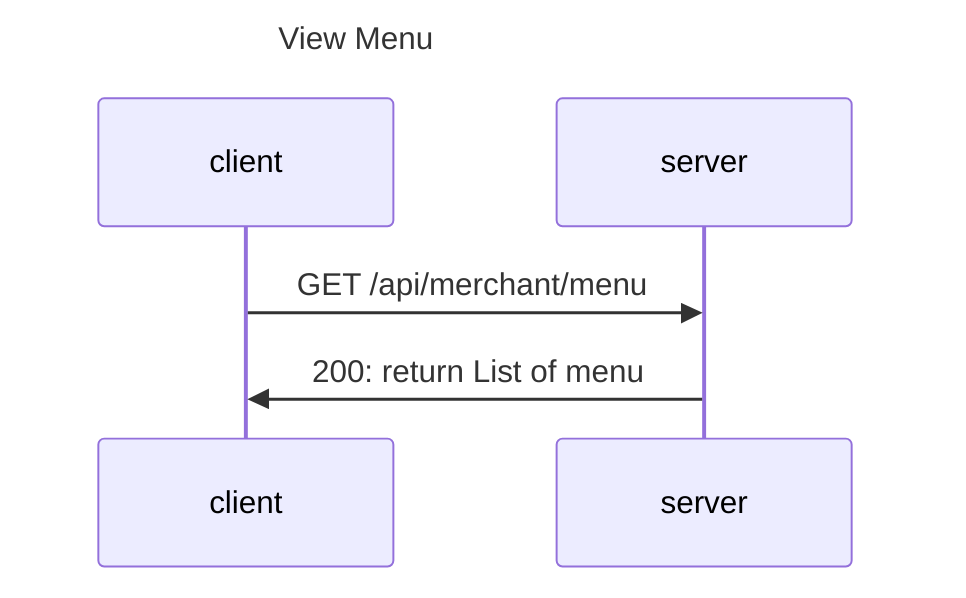
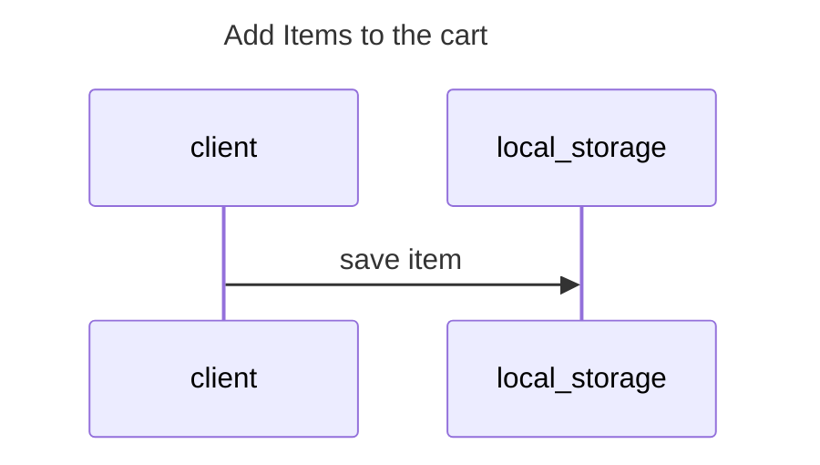
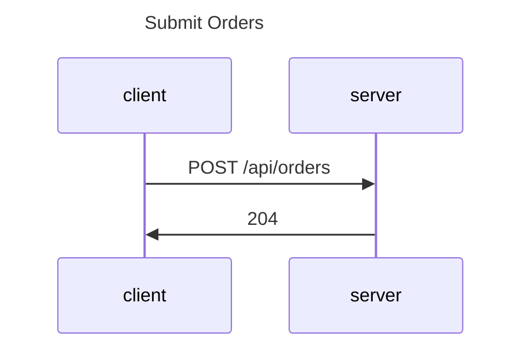
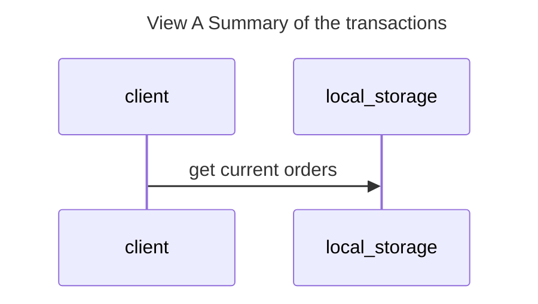

```mermaid
---
title: View Menu

Ref: https://developer.grab.com/docs/grabfood/api/v1-1-3#tag/get-menu/operation/get-menu
---
sequenceDiagram
    participant client
    participant server
    client->>server: GET /api/merchant/menu
    server->>client: 200: return List of menu

```

```mermaid
---
title: Add Items to the cart
---
sequenceDiagram
    participant client
    participant local_storage
    client->>local_storage: save item

```

```mermaid
---
title: Submit Orders
ref : https://developer.grab.com/docs/grabfood/api/v1-1-3#tag/submit-order/operation/submit-order-api
---
sequenceDiagram
    participant client
    participant server
    client->>server: POST /api/orders
    server->>client: 204

```

```mermaid
---
title: View A Summary of the transactions
---
sequenceDiagram
    participant client
    participant local_storage
    client->>local_storage: get current orders

```